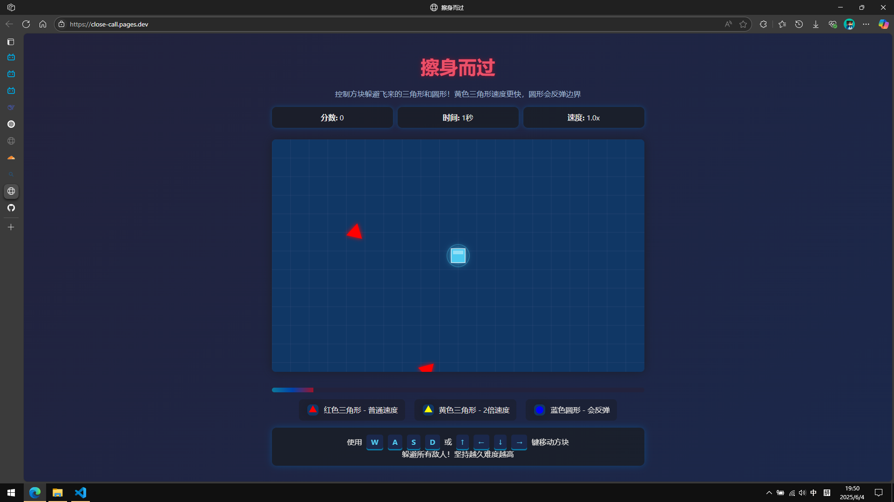

# 擦身而过 · Close Call

> 一款由 HTML + CSS + JavaScript 编写的轻量级躲避类小游戏。  
> 控制你的方块角色，在越来越密集的飞行物中生存下去，挑战你的反应极限！

---

## 🎮 游戏玩法

- 控制主角方块，通过方向键移动；
- 躲避从四面八方飞来的**三角形敌人**和**反弹圆形**；
- 红色三角形：普通速度；
- 黄色三角形：速度翻倍，危险更高；
- 圆形：首次碰到边界后反弹，轨迹难以预测；
- 每成功躲避一波敌人，你会获得 1 分；
- 随着时间增加，敌人出现频率和速度逐渐上升！

---

## 🖼️ 游戏截图

